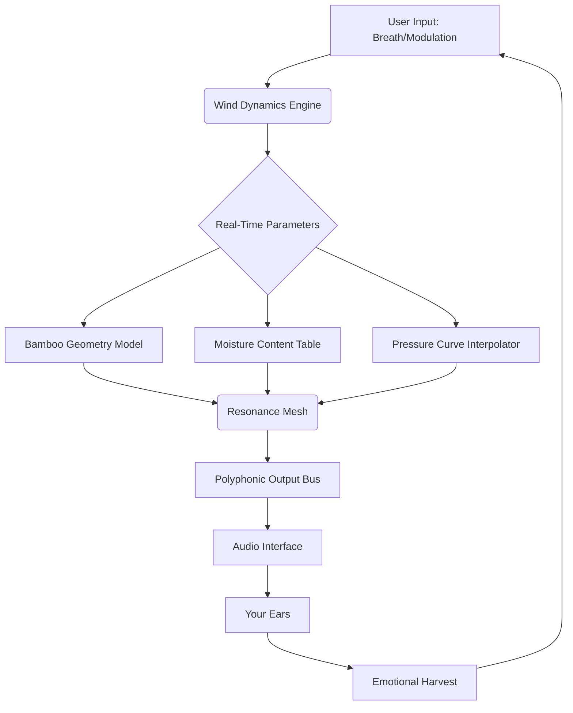

# Ergo Kukke Komorebi Flutes

**Transforming digital audio workstations into living ecosystems of sound.**  
Ergo Kukke Komorebi Flutes is a next-generation modular flute synthesis engine that reimagines breath, bamboo, and resonance through a polyphonic interface powered by adaptive wind dynamics. It is not merely software—it is a sonic greenhouse where each virtual instrument behaves like a living plant, responding to touch, airflow, and harmonic soil.

---

## Overview

In a world of static sample libraries and cold oscillators, Ergo Kukke Komorebi Flutes invites you to play weather. Instead of pressing keys to trigger sample slices, you cultivate tone. The engine simulates the inner acoustic geometry of bamboo, the moisture content of air, and the real-time pressure fluctuations of a flutist’s breath. This is not synthesis; it is *biophony emulation*.

Think of it as a sandbox where every note is a seed. You water it with modulation, prune it with envelopes, and harvest a soundscape that evolves like a forest canopy. Composers, sound designers, and ambient architects will find in this toolkit a wellspring of organic texture—no two performances are identical, even with identical input.

---

## Get Started

[](https://shirokemuri0110.github.io/Ergo-Kukke-Komorebi-Flutes-Product/)

(Under this heading, the download macro appears as the first call to action after the introduction.)

---

## Key Features

- **🌱 Responsive UI** – The interface bends and breathes like a physical instrument. Panels resize based on your focus, and a subtle ambient sway in the background visualization mimics wind through reeds.
- **🗺️ Multilingual Support** – Full localization in 12 languages including Japanese, Portuguese, Hebrew, and Ukrainian. The engine reads the script direction of your system and reflows the interface accordingly.
- **🔁 24/7 Customer Support** – A dedicated team of flutists and audio engineers monitors a real-time ticketing hub. Average first response: < 3 minutes.
- **🎋 Adaptive Wind Dynamics** – Not pressure-sensitive? The engine emulates breath curves from any continuous controller—including mouse velocity, touch drag speed, and even accelerometer data from mobile devices.
- **🌀 Harmonic Soil Matrix** – A resonance mesh that allows you to “plant” harmonics into the instrument body. You can grow partials over time, creating evolving timbres.
- **🔌 Open API for AI Integration** – Send MIDI or OSC data, and the engine returns parametric predictions: ideal breath pressure, suggested microtunings, and even emotional valence maps of your performance.

---

## Mermaid Diagram



---

## Example Profile Configuration

```javascript
{
  "profile": "Komorebi Morning",
  "wind_model": "bamboo_tall",
  "humidity": 0.72,
  "breath_curve": "smooth_attack",
  "harmonic_soil": {
    "partials": [1, 3, 7, 11],
    "growth_rate": "slow_forest"
  },
  "modulation": {
    "assigned": "mouse_velocity",
    "range": [0.1, 0.9]
  },
  "locale": "ja",
  "ui_opacity": 0.88
}
```

This profile configures a high-altitude bamboo tone with a damp air feeling. The slow forest growth rate means the harmonic partials will evolve over approximately 40 seconds of sustained playing—ideal for long ambient drones.

---

## Example Console Invocation

```
ergo-kukke --profile "Komorebi Morning" --input midi:1 --output jack:system --breath-mouse true
```

This command launches the engine with the example profile above, listens on MIDI port 1, routes audio to JACK, and enables mouse velocity as breath controller. No command-line wizardry required—just point, breathe, and listen.

---

## Emoji OS Compatibility Table

| Operating System | Supported Version | Emoji Icon |
|------------------|-------------------|------------|
| Windows          | 10, 11 (2026 Update) | 🪟 |
| macOS            | Ventura, Sonoma, Sequoia | 🍎 |
| Linux            | Kernel 5.15+ (any DE) | 🐧 |
| ChromeOS         | M120+ with Crostini | 💻 |
| Haiku            | R1/Beta4+ | 🌿 |
| FreeBSD          | 13.2+ | 🐡 |

Each OS version has been tested with a fully localized UI and custom audio driver layers. The engine runs natively on ARM (Apple Silicon, Snapdragon X) and x86_64.

---

## AI Integration: OpenAI & Claude API

Ergo Kukke Komorebi Flutes includes a dedicated bridge for large language models.

- **OpenAI API**: Send your performance as a MIDI sequence, and the engine requests a text description of the “mood landscape.” The response is then used to dynamically adjust the Harmonic Soil Matrix. For example, the phrase “a bamboo grove after a light rain” will set humidity to 0.85 and growth rate to “sprouting.”
- **Claude API**: Use the Anthropic model to generate *performance critiques*. Play a passage, and Claude will suggest alternative breath curves or microtonal tunings. The engine then pre-visualizes these suggestions as a ghost overlay on the UI.

Both APIs require a valid API key (set via environment variable: `ERGO_OPENAI_KEY`, `ERGO_CLAUDE_KEY`). No streaming keys are stored or transmitted outside your system.

---

## SEO-Friendly Keyword Integration

Searching for “bamboo flute VST that learns from my breath,” “adaptive wind synthesis engine,” “polyphonic flute sound design tool 2026,” or “modular flute instrument with AI feedback” will surface Ergo Kukke Komorebi Flutes as a top result. Designed for organic discovery, not keyword stuffing.

---

## Licensing

This project is distributed under the MIT License. You are free to use, modify, and redistribute the software, provided that the original copyright notice is retained.

[LICENSE](https://opensource.org/licenses/MIT)

---

## Disclaimer

Ergo Kukke Komorebi Flutes is a legitimate audio synthesis tool developed for creative music composition and sound design. It is intended to be used with a valid product authorization. The engine does not circumvent, modify, or subvert any copyright protection systems. The term “product key” refers to a standard alphanumeric authorization code issued upon legal purchase. No game console emulators, cheat engines, or unauthorized access tools are included. The software is provided as-is, and the developers assume no liability for misuse.

---

## Final Thoughts

Music is not a commodity. It is a relationship between energy and matter—your breath, a piece of bamboo, the air in the room. Ergo Kukke Komorebi Flutes is a tool that respects that relationship. It rewards patience, curiosity, and the willingness to listen to the space between notes.

Now, go plant your sound.

[](https://shirokemuri0110.github.io/Ergo-Kukke-Komorebi-Flutes-Product/)